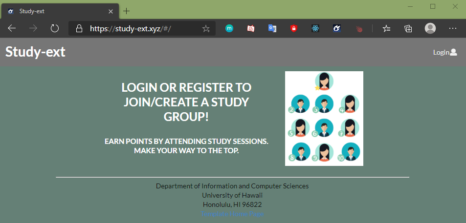
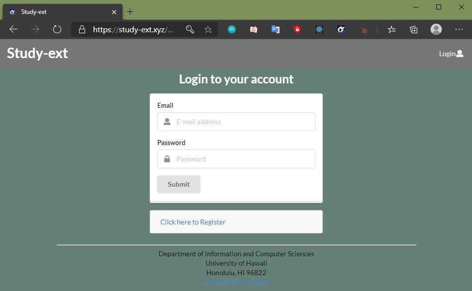
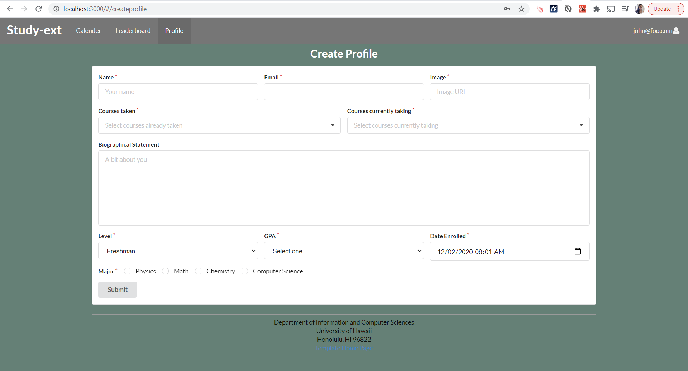
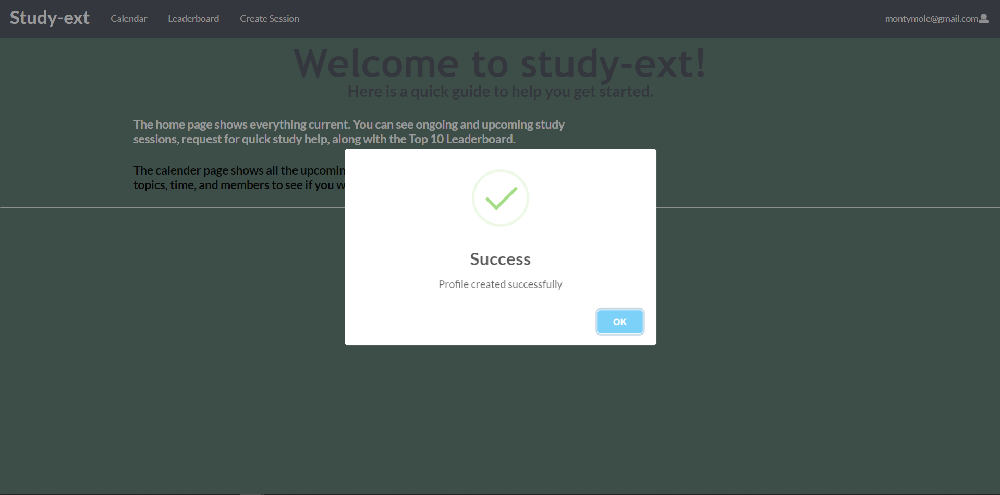
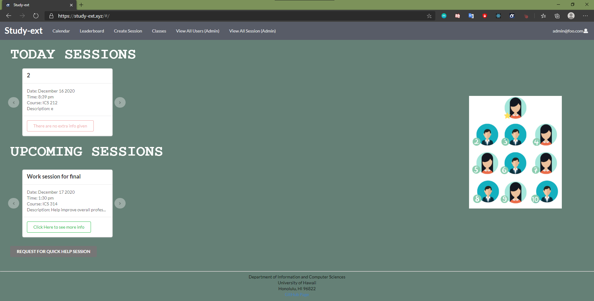
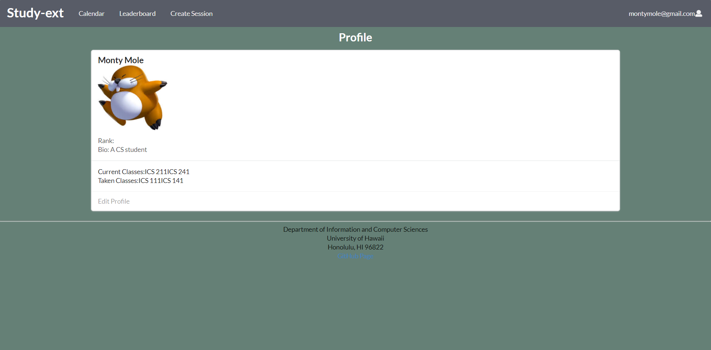
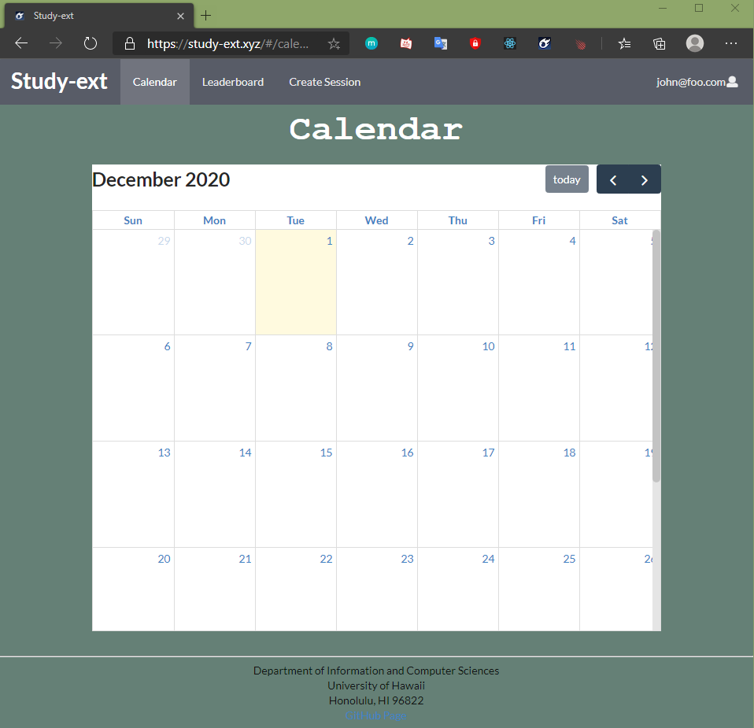
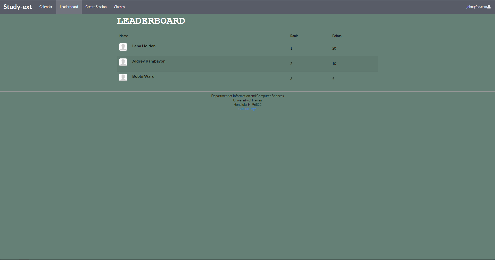
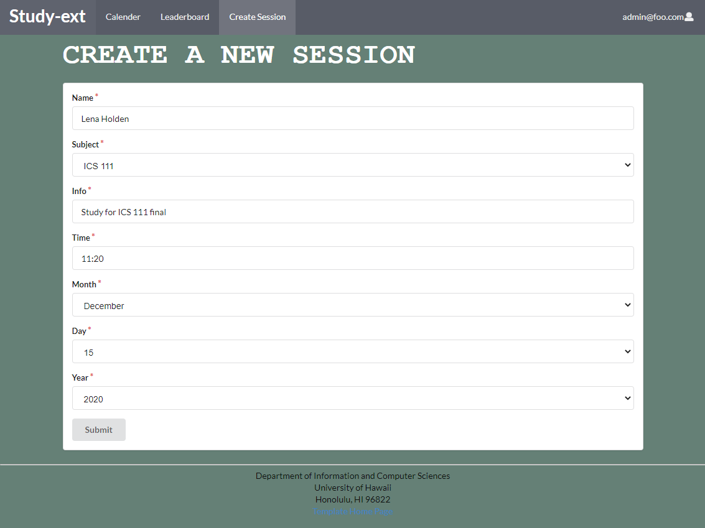

## Table of contents

* [Overview](#overview)
* [Deployment](#deployment)
* [User Guide](#user-guide)
* [Developer Guide](#developer-guide)
* [Milestone 1](#milestone-1)
* [Milestone 2](#milestone-2)
* [Team Members](#team-members)

## Overview
The overall goal for our project is to create an interface which allows for students and classmates to be able to create effective collaborative interactions where students can obtain help on current ICS materials or help others. Another goal is to create an environment that is inviting and effective for students who would instead be struggling on their own, so they can receive assistance from other like minded students who are able to help. 

## Deployment

A live deployment of Study-ext is available at [https://study-ext.xyz](https://study-ext.xyz).

## User Guide

This section provides a walkthrough of the study-ext user interface and its capabilities.

### Landing Page

The landing page is presented to users when they visit the top-level URL to the site.



### Sign in and sign up

Click on the "Login" button in the upper right corner of the navbar, then select "Sign in" to go to the following page and login. You must have been previously registered with the system to use this option:



Alternatively, you can select "Sign up" to go to the following page and register as a new user:


### Create Profile Page

After registering a new account, you can will be redirected to a page to create a profile. You must enter your name, and provide a headshot photo. You will additionally have the options to select classes you are currently taking and classes you have already taken (and willing to be a mentor for). 



When you successfully submit your profile details, you will be redirected to a quick start page to help guide you through the website.



### Home page

After logging in, you are taken to the home page, where you can join sessions and even request for quick help:



### Profile page

In the upper right hand corner, you'll see your username with an icon. This is a dropdown menu and when you click it, you'll see two options: "Profile" and "Sign out". Clicking on "Profile" will take you to your own user profile, where you also have the option to edit your information.



### Calender

You can click the calender tab to see all the study sessions that are coming up so you can plan to go to them:



### Leaderboard

Here you will be able to see how you stack up against others. You get more points from your peers. It will give a little more insentive to go to these study sessions and learn:



### Create Session

Here you will be able to make sessions for people to come to you for help or gain help:



### Admin View All Users

Here on the admin side we are able to see everything about the user. This will also show us what classes they have taken by hovering the button!


### Admin View All Sessions

Here on the admin side we are able to see all thes sessions. Here we are givin all the information to go with the session so we know what is going on.


## Developer Guide

This section provides information of interest to Meteor developers wishing to use this code base as a basis for their own development tasks.

### Installation

First, [install Meteor](https://www.meteor.com/install).

Second, visit the [study-ext application github page](https://github.com/study-ext/study-ext), and click the "Use this template" button to create your own repository initialized with a copy of this application to your local computer.

Third, cd into the study-ext/app directory and install libraries with:

```
$ meteor npm install
```

Fourth, run the system with:

```
$ meteor npm run start
```

If all goes well, the application will appear at [http://localhost:3000](http://localhost:3000).

## Milestone-1
Link to our Milestone 1 page found [here](https://github.com/Study-ext/study-ext/projects/1). 

Our overall goals for milestone 1 was to create a rough outline of what we want our project to look like. We created mock up designs of each page within our site, including the landing, home, calendar, leaderboard, create a session, and profile page. Our main issue was designing a point system which we will use to rank our users. We have defined a point system, but it is subject to change later if we face problems. 

## Milestone-2
Link to our Milestone 2 page found [here](https://github.com/Study-ext/study-ext/projects/3?add_cards_query=is%3Aopen). 


## Team Members
[Ian Kimura](https://ian-kimura.github.io/)

[Jason Kaneshiro](https://jasonkaneshiro.github.io/)

[Angela Lau](https://angcylau.github.io/)

[Dino Mariano](https://d1lm.github.io/)
