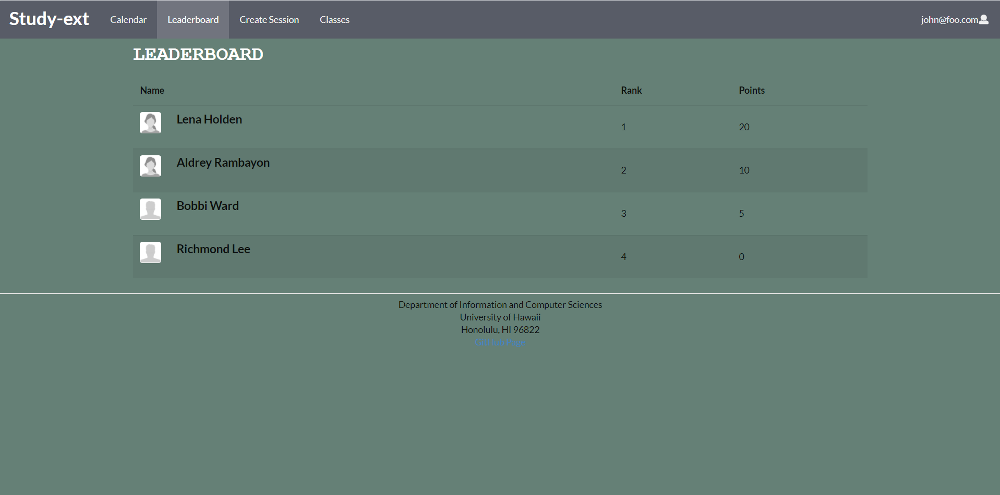

## Table of contents

* [Overview](#overview)
* [Team Members](#team-members)
* [Page Mockups](#page-mockups)
* [Milestone 1](#milestone-1)
* [Milestone 2](#milestone-2)
* [Finalized Pages](#Finalized-Pages)

## [study-ext Site](http://198.211.97.187/#/)

## Overview
The overall goal for our project is to create an interface which allows for students and classmates to be able to create effective collaborative interactions where students can obtain help on current ICS materials or help others. Another goal is to create an environment that is inviting and effective for students who would instead be struggling on their own, so they can receive assistance from other like minded students who are able to help. 

## Team Members
[Ian Kimura](https://ian-kimura.github.io/)

[Jason Kaneshiro](https://jasonkaneshiro.github.io/)

[Angela Lau](https://angcylau.github.io/)

[Dino Mariano](https://d1lm.github.io/)

## Page Mockups

#### Landing Page
Page shown when first accessing the website. Gives short description of study-ext and prompts user to Sign In or Sign Up. Does not show any info on meeting sessions yet to preserve privacy. 

#### Registration Page
Register an account for study-ext using UH email and password. 

#### Sign In Page
Sign in to your account using UH email and password. 

#### User Home Page
Displays a navigation bar containing tabs for the Calendar, Leaderboard, Create Session page, and for account notifications and profile. The homepage contains interactable visuals containing information about ongoing sessions and upcoming sessions to join, along with a “Quick Help” section where users can request for quick help sessions from available mentors. On the left of the page, it shows a leaderboard of the current top 10 mentors. 

#### Calender Page
Shows a interactable calendar containing all the upcoming created sessions and their details. As a user you are able to see the other attendees and mentor of study sessions and join the sessions to let others know you will be there. 

#### Create Session Page
Users are able to create a study session. Each session requires a name, subject, added info, time and date. These sessions can range from reviewing for midterms to help on specific topics in ICS courses. 

#### Leaderboard Page
The leaderboard page shows the current rankings for students and mentors based off of points they have accumulated from attending study sessions. 

#### Profile Page
Profile page displays information about yourself, included is a headshot, name, role, rank, class, and bio. The headshot is visible to others so it is easier to recognize who are attending study sessions. The other information is to help others get to know you. 

#### Quick Start Guide
This page is opened up to any new user, ones who have just registered. Explains to the user the different aspects of the site and how to use it. 

## Milestone-1
Link to our Milestone 1 page found [here](https://github.com/Study-ext/study-ext/projects/1). 

Our overall goals for milestone 1 was to create a rough outline of what we want our project to look like. We created mock up designs of each page within our site, including the landing, home, calendar, leaderboard, create a session, and profile page. Our main issue was designing a point system which we will use to rank our users. We have defined a point system, but it is subject to change later if we face problems. 

## Milestone-2
Link to our Milestone 2 page found [here](https://github.com/Study-ext/study-ext/projects/3?add_cards_query=is%3Aopen). 

## Finalized Pages
Screenshots of finalized pages created from our mockups. 

### Landing Page

