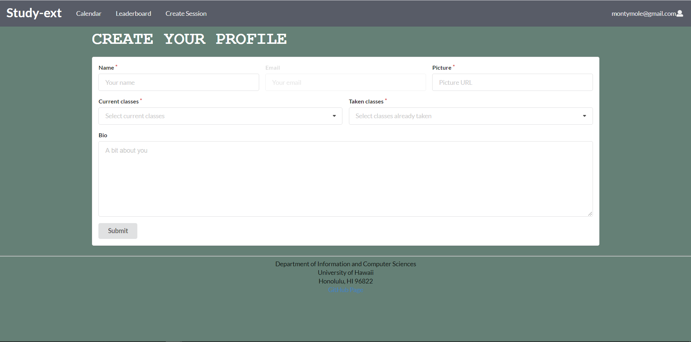

## Table of contents

* [Overview](#overview)
* [Deployment](#deployment)
* [User Guide](#user-guide)
* [Developer Guide](#developer-guide)
* [Milestone 1](#milestone-1)
* [Milestone 2](#milestone-2)
* [Team Members](#team-members)

## Overview
The overall goal for our project is to create an interface which allows for students and classmates to be able to create effective collaborative interactions where students can obtain help on current ICS materials or help others. Another goal is to create an environment that is inviting and effective for students who would instead be struggling on their own, so they can receive assistance from other like minded students who are able to help. 

## Deployment

A live deployment of Study-ext is available at [https://study-ext.xyz](https://study-ext.xyz).

## User Guide

This section provides a walkthrough of the study-ext user interface and its capabilities.

### Landing Page

The landing page is presented to users when they visit the top-level URL to the site.


### Sign in and sign up

Click on the "Login" button in the upper right corner of the navbar, then select "Sign in" to go to the following page and login. You must have been previously registered with the system to use this option:


Alternatively, you can select "Sign up" to go to the following page and register as a new user:


### Create Profile Page

After registering a new account, you can will be redirected to a page to create a profile. You must enter your name, and provide a headshot photo. You will additionally have the options to select classes you are currently taking and classes you have already taken (and willing to be a mentor for). 



When you successfully submit your profile details, you will be redirected to a quick start page to help guide you through the website.


### Home page

After logging in, you are taken to the home page, where you are able to see the sessions that are going on today and also upcoming events that are not scheduled for today. The button below the event will give you more information if it is not all shown. The quick help will direct you to the create session page where you are able to create a session for right now to get help.:


### Profile page

In the upper right hand corner, you'll see your username with an icon. This is a dropdown menu and when you click it, you'll see two options: "Profile" and "Sign out". Clicking on "Profile" will take you to your own user profile, where you also have the option to edit your information.


### Calender

You can click the calender tab to see all the study sessions that are coming up so you can plan to go to them:


### Leaderboard

Here you will be able to see how you stack up against others. You get more points from your peers. It will give a little more insentive to go to these study sessions and learn:


### Create Session

Here you will be able to make sessions for people to come to you for help or gain help:


### Classes

Here, you can see all of the students that are currently taking the class and students that have already taken the class.


### Admin View All Users

Here on the admin side we are able to see everything about the user. This will also show us what classes they have taken by hovering the button:


### Admin View All Sessions

Here on the admin side we are able to see all thes sessions. Here we are givin all the information to go with the session so we know what is going on:


## Developer Guide

This section provides information of interest to Meteor developers wishing to use this code base as a basis for their own development tasks.

### Installation

First, [install Meteor](https://www.meteor.com/install).

Second, visit the [study-ext application github page](https://github.com/study-ext/study-ext), and click the "Use this template" button to create your own repository initialized with a copy of this application to your local computer.

Third, cd into the study-ext/app directory and install libraries with:

```
$ meteor npm install
```

Fourth, run the system with:

```
$ meteor npm run start
```

If all goes well, the application will appear at [http://localhost:3000](http://localhost:3000).

## Feedback

Rhea Chung, Business

> Overall, Study-ext is a simple yet very useful site for students in need of studying. It is easy to figure out when there are sessions using the calendar page and it is also quite easy to create sessions of your own. One thing, I would like to see in the future is the ability to click on the sessions on the calendar to see the information for that session. Other than that, Study-ext is a great website for students to get to know each other and study.

Aljed Ereno, Computer Engineer

> The color choices is easy on the eyes, so staying on the site isn't a chore. Once you create an account and update your profile, maybe should of had a redirect to the calendar page. When creating a session, i thought the name was my name not the topic of the session (kinda nitpicky here though), maybe a tooltip should have appeared when hovering over the inputs. The main page is great, does what I expected it to do.

Spencer Young, Computer Engineer
> There is a lot of empty space in the middle of the home page. After creating a session, there should be a submission redirect back to the homepage. Leaderboard text should be white. The list classes page doesn't work, and the user profiles do not work. When I put the current classes that I have taken, they do not show up on my profile, or anyones profile. The website is pretty buggy.

Jake Castillo, Computer Engineer
> The vision that the study-ext team had was wonderful. Having a concrete goal in mind, helping other students not only benefits the mentees, but mentors who are able to give students a helping hand allows mentors to practice articulating ideas in the computer science field. From a UI perspective, the website is easy to use and easy to understand. One thing that I personally would add would be a small blurb about the overall website on the landing page or a separate page that described the goal of the team. Instead of just guiding users to create an account, it would be important to know exactly what the website is composed of. Aside from that, the black text footer and image stood out. With not rounded edges or a matching background, the image felt out of place. Moving through the website, the signup page was simple and sweet. Adding classes with a drop down that shows currently offered classes in the computer science track and additionally allows you to choose multiple classes was a nice touch. I would have liked to see an option that allows you to add classes. Checking user experience, I logged out and logged back in. The login screen is simple, sweet and does it’s job. Moving onto the new home screen, it lists current sessions and upcoming sessions. All are displayed inline, but the arrows were a little offcentered. The calendar page listed all of the events on a well made calendar and functioned as intended, but it would have been nice to see overall uniformity with either choosing right angle or rounded edges for the entire website. The leaderboard looked like a neat addition and allowed students to earn points for attending sessions. The create session page was simple and allowed users to add upcoming study sessions for people to attend. On the form the only awkward thing was how the “date” section functioned. Year was not completely intuitive and took a little to get used to and allowed for dates to be input all the way back to the year 0 A.D. Overall, a great baseline for a strong website. Could be used to help many people, but needed a little cleaning up and attention to detail.

Frendy Lio Can, Computer Engineer
> I don't like the color choice and the classes page is broken. Other than that, its ok.

Diwen Lin, Systems Track Electrical Engineer
> It looks nice to me. I like how you can get points from teaching your peers after every session. However, the classes tab is broken and I can't see the classes that I have attended in my profile. 

Kelly Ngo, Systems Track Eletrical Engineer
> I like the overall aesthetic of the website. It looks professional, and trust-worthy. I think website is kind of empty, and does not paint a clear picture to what the website is. The home page does not explain what the website is supposed to be, or the information on the website includes different types of things, such as a table in Leaderboard, as well as a schedule in Calendar. The "Classes" Table (4th column in Directory) does not work, and I cannot backtrack to original website. So this looks like a bug.

Ryan Kim, Liberal Arts
>  This website is very neat and organized and it is very easy to navigate around. I like how the point system gives students a drive to do more of these sessions that are beneficial to them, not only that you can also see the profiles of the other students almost like a social media platform but for group study sessions. I did not run into many bugs but the one bug that I did run into was when sometimes when I would try and click "Create Session" or "Classes" it would not take me to the page but instead make the site go blank and it would just be the sea foam green color of the main page.

Matthew Stankiewicz, Liberal Arts/Business
> Creating a session inputs details into the calendar properly. The leaderboards seem to be working properly, all the numbers are listed in the correct order. The one issue with the site is the classes tab. Clicking on the tab gives you a blank screen and clicking on any other tab afterwards will also give you a blank screen. The only way to reset this is by refreshing the page.

Keenan Lee, Computer Engineer
> The website is very clean looking. The implementation of the calendar is good, and the landing page is practical. There several bugs in the website like the class tab not working, and the classes taken in profile creation.

## Milestone-1
Link to our Milestone 1 page found [here](https://github.com/Study-ext/study-ext/projects/1). 

Our overall goals for milestone 1 was to create a rough outline of what we want our project to look like. We created mock up designs of each page within our site, including the landing, home, calendar, leaderboard, create a session, and profile page. Our main issue was designing a point system which we will use to rank our users. We have defined a point system, but it is subject to change later if we face problems. 

## Milestone-2
Link to our Milestone 2 page found [here](https://github.com/Study-ext/study-ext/projects/3?add_cards_query=is%3Aopen). 

## Milestone-3
Link to our Milestone 3 page found [here](https://github.com/Study-ext/study-ext/projects/4).

## Team Members
[Ian Kimura](https://ian-kimura.github.io/)

[Jason Kaneshiro](https://jasonkaneshiro.github.io/)

[Angela Lau](https://angcylau.github.io/)

[Dino Mariano](https://d1lm.github.io/)
